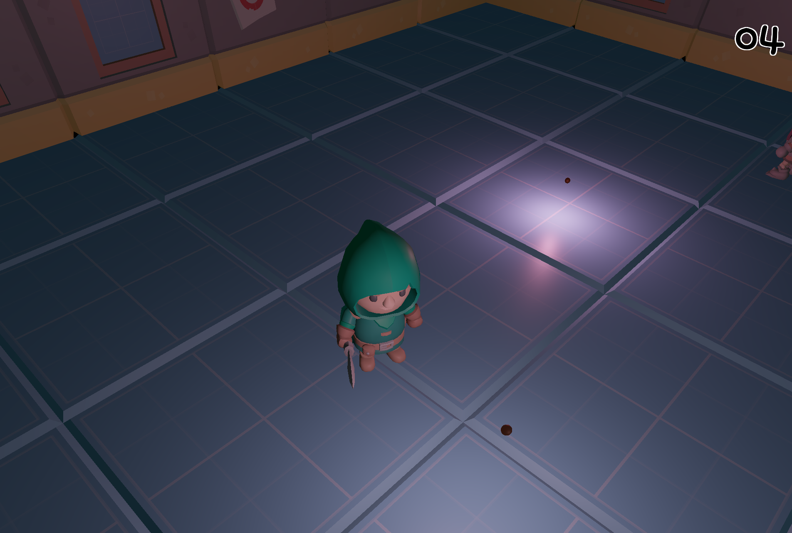

# collect_the_donut

Everyone knows donuts are the most precious things in the Universe.
Now, you get to collect them all.
The Wisps are harmless; beware of the skeletons though.



## How to play

- WASD to move
- Click to attack
- Walk over the donut to collect it

## Setup

In order to run, you will need to follow [the pre-requisites for setting up flame_3d](https://github.com/flame-engine/flame/tree/main/packages/flame_3d#prerequisites); notably:

Enable Impeller by adding the following key to `/macos/Runner/Info.plist`:

```xml
<dict>
    ...
 <key>FLTEnableImpeller</key>
 <true/>
</dict>
```

And then run with:

```bash
flutter run -d macos --enable-flutter-gpu
```
